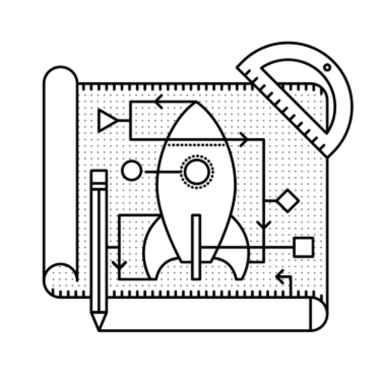

# ブループリント

## ブループリントとは何か
ブループリントとはビュー、テンプレート、静的ファイル、アプリケーションに適用される拡張をまとめて定義する機能です。
例として、管理画面のブループリントを思い浮かべてみて下さい。
このブループリントは*/admin/login*や*/admin/dashboard*というようなURLルーティングを行うビューを持っているとします。
また、テンプレートや静的ファイルの提供も行います。
そしてこのブループリントをSNSやCRMなど、既存のアプリケーションに追加することができます。

## なぜブループリントを使うのか
ブループリントの主な用途はアプリケーションを独立したコンポーネントに整理することです。
例えばTwitterの様なマイクロブログでは*index.html*や*about.html*といったページを含むブループリントを持つでしょう。
更にログイン後のダッシュボードや管理パネルなども必要になるでしょう。
この様な独立した機能はコード上でも同様に分離することが可能です。
これらを「アプリケーション」より小さい単位で構造化してみましょう。

**注記**

ブループリントのメリットや詳細についてはFlaskのドキュメントを参照して下さい。

["Why Blueprints"](http://flask.pocoo.org/docs/blueprints/#why-blueprints)

## どう配置する?
その他のFlaskの機能と同様に、ブループリントを管理する方法は複数あります。
ブループリントの管理方法はビジネス用語で例えると機能別組織と部門別組織という様に考えることが出来ます。

### 機能別構造
機能別構造では、機能よってアプリケーションの部品を整理します。
テンプレートは1つのディレクトリにまとめ、静的ファイルや、ビューも同様です。

~~~
yourapp/
    __init__.py
    static/
    templates/
        home/
        control_panel/
        admin/
    views/
        __init__.py
        home.py
        control_panel.py
        admin.py
    models.py
~~~

*yourapp/views/\_\_init\_\_.py*を除き、上記の*yourapp/views/*ディレクトリに配置された*.py*ファイルはブループリントです。
*yourapp/\_\_init\_\_.py*ではブループリントのインポートと、`Flask()`オブジェクトの**登録**を行います。
これについては後の章で説明します。

**注記**
執筆時でFlaskの公式WEBサイトはこの機能別構造を利用しています。

<http://flask.pocoo.org>

これはGithubで確認出来ます。

<https://github.com/mitsuhiko/flask-website/tree/website/flask_website>

### 部門別構造
部門別構造では部品がアプリケーションのどの部分に寄与するかどうかで整理を行います。
管理パネルというディレクトリにテンプレートやビュー、静的ファイルを配置し、同様にユーザー管理パネルというディレクトリにも各ファイルを配置します。

~~~
yourapp/
    __init__.py
    admin/
        __init__.py
        views.py
        static/
        templates/
    home/
        __init__.py
        views.py
        static/
        templates/
    control_panel/
        __init__.py
        views.py
        static/
        templates/
    models.py
~~~

上記に示したような部門別構造では、*yourapp/*下の各ディレクトリが個別のブループリントとなります。
全てのブループリントは最上位の*\_\_init\_\_.py*で登録されます。

### どっちが良いの?
組織の構成方法は個人的な好みで選んで構わないと思います。
唯一の違いは階層が表現されているかどうかです。
Flaskアプリケーションはどちらの方法でも構築可能ですので、あなたはどちらかを選択する必要があります。

もしもアプリケーションがモデルと設定のみを共有し、それ以外は独立しているのであれば部門別構造が良いかもしれません。
例えばユーザー自身がWEBサイトを構築するSaaSアプリケーションの場合、ホームページやコントロールパネル、管理パネルといったブループリントを持ち、これらのコンポーネントは完全に独立したテンプレートや静的ファイルを持つ可能性があります。
もしこれらのブループリントを他のプロジェクトに再利用しようと考えている場合は部門別構造の方が作業が簡単になるでしょう。

一方、アプリケーションに依っては機能別分類の方が適している場合もあります。
例えばFlaskでFacebookの様なアプリケーションを構築する場合、静的ページやダッシュボード、プロフィール、設定画面など、多くのブループリントを持つでしょう。
これらのコンポーネントは基本レイアウトとスタイルは共通ですが、それぞれ独自のレイアウトを持っています。
もしFacebookをFlaskで実装したらどの様なファイル構成になるかを以下に示します。

~~~
facebook/
    __init__.py
    templates/
        layout.html
        home/
            layout.html
            index.html
            about.html
            signup.html
            login.html
        dashboard/
            layout.html
            news_feed.html
            welcome.html
            find_friends.html
        profile/
            layout.html
            timeline.html
            about.html
            photos.html
            friends.html
            edit.html
        settings/
            layout.html
            privacy.html
            security.html
            general.html
    views/
        __init__.py
        home.py
        dashboard.py
        profile.py
        settings.py
    static/
        style.css
        logo.png
    models.py
~~~

*facebook/views/*以下のブループリントは独立したコンポーネントというよりビューの集合と言えるでしょう。
これらのブループリントは共通の静的ファイルを利用し、テンプレートは基本となるテンプレートを継承しています。
機能別構造はこの様なプロジェクトを整理する事に向いています。

## どうやって利用するの?

### 基本的な利用方法

それでは、Facebookの例でブループリントの利用方法を見ていきましょう。

~~~ {language="Python"}
# facebook/views/profile.py

from flask import Blueprint, render_template

profile = Blueprint('profile', __name__)

@profile.route('/<user_url_slug>')
def timeline(user_url_slug):
    # なんらかの処理
    return render_template('profile/timeline.html')

@profile.route('/<user_url_slug>/photos')
def photos(user_url_slug):
    # なんらかの処理
    return render_template('profile/photos.html')

@profile.route('/<user_url_slug>/about')
def about(user_url_slug):
    # なんらかの処理
    return render_template('profile/about.html')
~~~

ブループリントオブジェクトを作るには、まず、`Blueprint()`クラスをインポートして引き数に名前とインポート名を与えて初期化します。
通常インポート名は`__name__`で構いません。これは現在のモジュール名を表すPythonの特別な変数です。

今回のFacebookの例では機能別構造を採用しています。
部門別構造を採用している場合はブループリント用のテンプレートや静的ファイルが配置されたディレクトリをFlaskに伝えてやる必要があります。
以下にそのコードを示します。

~~~ {language="Python"}
profile = Blueprint('profile', __name__,
                    template_folder='templates',
                    static_folder='static')
~~~

これでブループリントが定義されました。続いてブループリントをFlaskアプリケーションに登録します。

~~~ {language="Python"}
# facebook/__init__.py

from flask import Flask
from .views.profile import profile

app = Flask(__name__)
app.register_blueprint(profile)
~~~

これで*facebook/views/profile.py*に定義されたルーティングがアプリケーションに登録されました。

### 動的URLプレフィックス

引き続きFacebookの例で説明すると、プロフィールに関する全てのルーティングは`<user_url_slug>`で始まる変数をビューに渡しています。
*https://facebook.exmaple.com/john.doe*という様なURLでプロフィールページにルーティングしたい場合、動的プレフィックスを定義することでこれを実現できます。

Blueprintsでは静的なプレフィックスと動的なプレフィックスを定義できます。
静的なプレフィックスの例では、ブループリントの全てルーティングは*/profile*から始まるURLになっていました。
これを動的なプレフィックスに変更しようと思います。

どちらのプレフィックスを選択するかどうかは2箇所のうちどちらかの方法で指定します。
`Blueprint()`クラスの初期化持と`app.register_blueprint()`による登録時です。

~~~ {language="Python"}
# facebook/views/profile.py

from flask import Blueprint, render_template

profile = Blueprint('profile', __name__, url_prefix='/<user_url_slug>')

# [...]

# facebook/__init__.py

from flask import Flask
from .views.profile import profile

app = Flask(__name__)
app.register_blueprint(profile, url_prefix='/<user_url_slug>')
~~~

どちらの方法でも技術的な制限はありませんが、登録時に行う方が良いでしょう。
この方法であればコードをトップレベルに移動することも簡単です。

`route()`と同様に動的なプレフィックスを生成するコンバーターを利用することもできます。
このコンバーターは自分で定義しても構いません。
コンバーターを利用する場合、ビューに値が渡される前に前処理を行うことができます。
以下の例では、ブループリントにルーティングされる際にユーザーオブジェクトを取得する関数を定義し、`url_value_preprocessor()`でデコレートしています。

~~~ {language="Python"}
# facebook/views/profile.py

from flask import Blueprint, render_template, g

from ..models import User

# The prefix is defined on registration in facebook/__init__.py.
profile = Blueprint('profile', __name__)

@profile.url_value_preprocessor
def get_profile_owner(endpoint, values):
    query = User.query.filter_by(url_slug=values.pop('user_url_slug'))
    g.profile_owner = query.first_or_404()

@profile.route('/')
def timeline():
    return render_template('profile/timeline.html')

@profile.route('/photos')
def photos():
    return render_template('profile/photos.html')

@profile.route('/about')
def about():
    return render_template('profile/about.html')
~~~

ここでプロフィールのユーザー名を格納している'g'オブジェクトはJinja2テンプレートのコンテキストで有効です。
これによりテンプレートの中で必要な情報を参照できるので、ビューでやるべき事はテンプレートをレンダリングするだけです。

~~~ {language="HTML"}
{# facebook/templates/profile/photos.html #}




    

~~~

**注記**

- Flask公式ドキュメントの[素晴らしいチュートリアルには](http://flask.pocoo.org/docs/patterns/urlprocessors/#internationalized-blueprint-urls)、動的プレフィックスを利用してURLを国際化する例が紹介されています。

### 動的サブドメインの利用
近年、ユーザーにサブドメインを提供するSaaSアプリケーションが多く見られます。
Harvestというコンサルタント向けの勤怠管理アプリケーションを例に挙げると、
このアプリケーションは各ユーザーのダッシュボードをyourname.harvestapp.comというURLで提供しています。
この様な動的なサブドメインをFlaskでどの様に扱うかを説明します。

この節では、ユーザーが自分のWEBサイトを作成するアプリケーションを例に説明していきます。
このアプリケーションは3つのブループリントを持っていると想像してみてください。

* ユーザーがログインするホームページ
* ユーザーのWEBサイト
* ユーザーのWEBサイトを編集する管理パネル

これらのブループリントは比較的粗結合ですので、部門別構造で管理したいと思います。

~~~
sitemaker/
    __init__.py
    home/
        __init__.py
        views.py
        templates/
            home/
        static/
            home/
    dash/
        __init__.py
        views.py
        templates/
            dash/
        static/
            dash/
    site/
        __init__.py
        views.py
        templates/
            site/
        static/
            site/
    models.py
~~~

以下の表はこのアプリのブループリントの解説です。

  ------------------------------------------------------------------------
  URL                  ルーティング 説明
  -------------------- ------------ --------------------------------------
  sitemaker.com        *sitemaker/h なんの変哲もないブループリントです。
                       ome*         ビューとテンプレートと静的ファイルを含みます

  bigdaddy.sitemaker.c *sitemaker/s このブループリントは
  om                   ite*         動的サブドメインを利用するユーザーWEBサイトです。
                                    このコードについて後ほど詳しく見ていくよ

  bigdaddy.sitemaker.c *sitemaker/d このブループリントは
  om/admin             ash*         動的サブドメインとURLプレフィックスの両方のテクニックを利用しています。
  ------------------------------------------------------------------------

動的サブドメインはURLプレフィクスと同じ方法で定義できます。
2種類の方法はどちらでも利用できますが、ここでは*sitemaker/\_\_init.py\_\_*に記述します。

~~~ {language="Python"}
# sitemaker/__init__.py

from flask import Flask
from .site import site

app = Flask(__name__)
app.register_blueprint(site, subdomain='<site_subdomain>')
~~~

部門別構造を採用しているので、ブループリントは*sitema-ker/site/\_\_init\_\_.py*.に定義します。

~~~ {language="Python"}
# sitemaker/site/__init__py

from flask import Blueprint

from ..models import Site

# Siteの大文字と小文字に注意して下さい。
# これらは異なる識別子です。
# Siteはモデルであり、siteはブループリントです。

site = Blueprint('site', __name__)

@site.url_value_preprocessor
def get_site(endpoint, values):
    query = Site.query.filter_by(subdomain=values.pop('site_subdomain'))
    g.site = query.first_or_404()

# siteを生成した後にviewsをインポートしてください。
# viewsモジュール内で'site'をインポートしていますので、viewsをインポートする前にsiteが定義されている必要があります。

import .views
~~~

この様にして、データーベースからサイト情報を取得してサブドメインに応じたユーザーサイトを表示できます。

Flaskでサブドメインを利用するには、設定に`SERVER_NAME`を指定する必要があります。

~~~ {language="Python"}
# config.py

SERVER_NAME = 'sitemaker.com'
~~~

**注記**

この節の草稿を書いた数分後の事、
このサブドメインは開発環境で動作するけど本番環境では動作しないよ、とIRCで誰かが言いました。
正しく`SERVER_NAME`を設定してあるか尋ねると、開発環境では設定されていたが本番環境では設定されていなかった、というオチでした。

**注記**

サブドメインとurl\_prefixを両方設定することも可能です。
先ほどの表に示した*sitemaker/dash*をルーティングする例がまさしくそうです。

## 小さなアプリケーションをブループリントを使うように書き換える

ここでは既存のアプリケーションをブループリントを使うように書き換える手順をまとめておきたいと思います。
以下に、典型的なFlaskアプリケーションのディレクトリ構成を示します。

~~~
config.txt
requirements.txt
run.py
U2FtIEJsYWNr/
  __init__.py
  views.py
  models.py
  templates/
  static/
tests/
~~~

なんと*views.py*のコードが1万行にも増えてしまいました!
これまでリファクタリングを先送りしてきましたが年貢の納めどきの様です。
このファイルにはサイト全てのコンテンツが含まれています。
サイト内のコンテンツは、ホームページ、ユーザーダッシュボード、管理ダッシュボード、APIと会社のブログです。

### ステップ1: 部門別か機能別か?

このアプリケーションは、明確に独立したコンテンツを持っています。
恐らくテンプレートや静的ファイルを共有する事は無いでしょう、という訳で部門別構造で行きましょう。

### ステップ2: ファイルの移動

**警告**

アプリケーションに変更を加える前にバージョン管理システムにコミットしましょう。
間違ってファイルを削除する心配がなくなります。

続いて、新しいアプリケーション用のディレクトリツリーを作成し、
各ブループリントに対応するパッケージディレクトリを作成します。
そしてブループリントのディレクトリに *views.py*や*static/*、*templates/*をコピーします。
これが終わると、最上位のディレクトリからこれらを削除してかまいません。

~~~
config.txt
requirements.txt
run.py
U2FtIEJsYWNr/
  __init__.py
  home/
    views.py
    static/
    templates/
  dash/
    views.py
    static/
    templates/
  admin/
    views.py
    static/
    templates/
  api/
    views.py
    static/
    templates/
  blog/
    views.py
    static/
    templates/
  models.py
tests/
~~~

### ステップ3: ゴミ捨て

次に、各ブループリントの不要なビューや静的ファイルを削除していきます。
このステップはアプリケーションの構成方法により異なります。

最終的に各ブループリントが*views.py*を持つようになります。
複数のブループリントが同じルーティングを定義してはいけません。
*templates/*ディレクトリは同じブループリント内のビューのみで利用すべきです。
同様に*static/*ディレクトリも同じブループリント内で利用されるべきです。

**注記**

できるだけ不必要なインポートを避けてください。
これは忘れがちですがコードがより煩雑になり、最悪の場合アプリケーションが遅くなります。

### ステップ4: Blueprintを実装する

ここではブループリントのディレクトリに移り*\_\_init\_\_.py*を実装していきます。
まずは以下の様にブループリントのAPIを呼び出します。

~~~ {language="Python"}
# U2FtIEJsYWNr/api/__init__.py

from flask import Blueprint

api = Blueprint(
    'site',
    __name__,
    template_folder='templates',
    static_folder='static'
)

import .views
~~~

続いてU2FtIEJsYWNrパッケージの最上位にある、*\_\_init\_\_.py*でブループリントの登録を行います。

~~~ {language="Python"}
# U2FtIEJsYWNr/__init__.py

from flask import Flask
from .api import api

app = Flask(__name__)

# Puts the API blueprint on api.U2FtIEJsYWNr.com.
app.register_blueprint(api, subdomain='api')
~~~

appオブジェクトでなく、blueprintオブジェクトでルーティングが行われているか確認してください。

~~~ {language="Python"}
# U2FtIEJsYWNr/views.py

from . import app

@app.route('/search', subdomain='api')
def api_search():
    pass
~~~

~~~ {language="Python"}
# U2FtIEJsYWNr/api/views.py

from . import api

@api.route('/search')
def search():
    pass
~~~

### ステップ5: 楽しむ

これで巨大な*views.py*ファイルに記述されていたアプリケーションをモジュール構成にすることができました。
ブループリントでまとめることでルーティングの定義はより単純になり、URLプレフィックスやサブドメインの設定を1度に行えるようになりました。

## まとめ
- ブループリントはビュー、テンプレート、静的ファイル、その他の適用された拡張の集合です。
- ブループリントはアプリケーションを組織化するための素晴らしい方法です。
- 部門別構造では各ブループリントはアプリケーションの項目毎にビュー、テンプレート、静的ファイルなどをまとめて配置します。
- 機能別構造では各ブループリントは唯のビューの集合です。テンプレートは静的ファイルと同様にすべてまとめて配置されます。
- ブループリントを利用するには、まず定義を行い、`Flask.register_blueprint()`でアプリケーションに登録します。
- 動的URLプレフィックスを利用して、全てのルーテイングをブループリントに適用することができます。
- 動的サブドメインを定義して全てのルーテイングをブループリントに適用することができます。
- 5段階の手順によってブループリントを利用するアプリケーションに書き換える事ができます。

